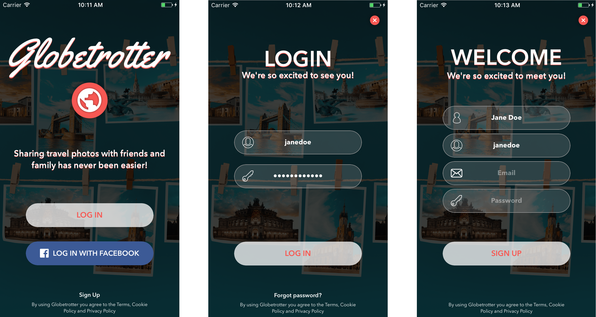

# Globetrotter - Social Media
Globetrotter is a universal (ipad and iphone) social media app where users can upload pictures of their travels.
It was designed using Sketch and later on developed in Xcode. It was developed in
MVC design pattern and using Parse and AWS to store user's data.

### Login and Signup
The login can be made through Facebook or email login.

Screenshots:

### Feed

### Settings
